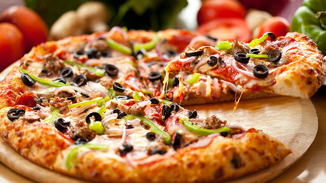
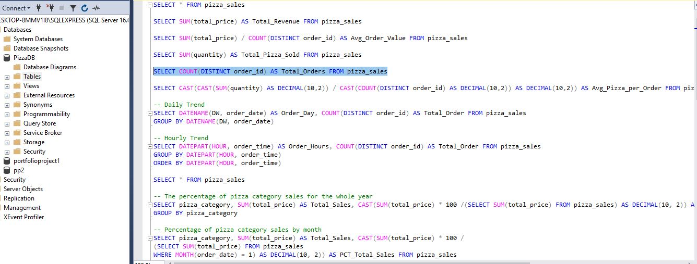
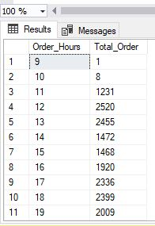
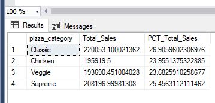
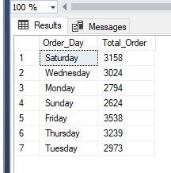
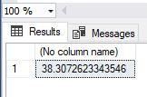
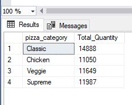
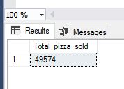
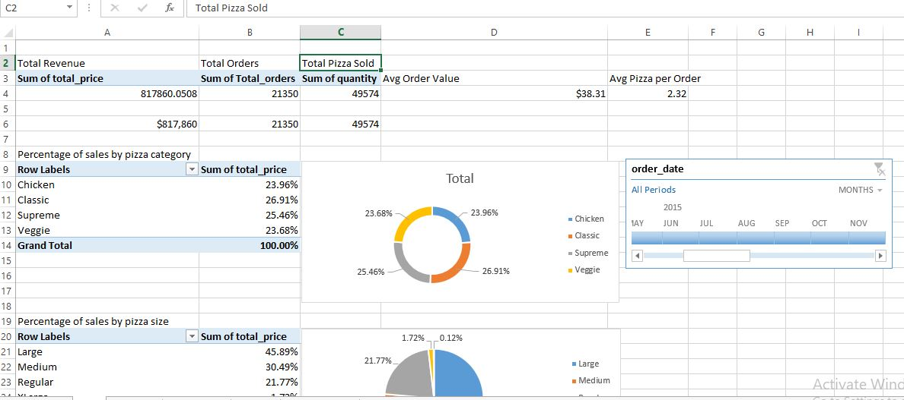
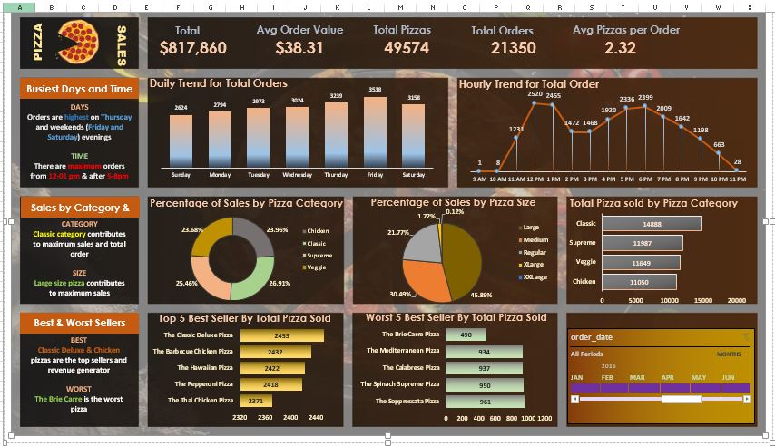

# BLOOM PIZZA

## Introduction
This is a project of an imaginary store called **Bloom Pizza**. This project is geared to analyze and derive insights to answering industrial question, helping industry make vital data driven decision in achieving maximum profit.
The use of Microsoft SQL server management system was used in curating solution to the project and Microsoft Excel was used also in curating solution and creating visuals to the solution of the industrial questions. 
Solution on both Microsoft SQL server management system and Microsoft Excel was compared and contrasted ensuring uniformity of the solution in both software before summarizing and visualizing the solution on dashboard.

## Problem Statement

**KPI REQUIREMENT**

We need to analyze key indicator for our pizza sales data to gain insight into our business performance. Specifically, we want to calculate the following.
- ***Total Revenue***: The sum of the total price of all pizza orders.

- ***Average Order value***: The average amount spent per order, calculated by dividing the total revenue by the total number of orders.

-***Total Pizza Sold***: The sum of the quantities of all pizza sold.

-***Total Orders***: The number of orders placed.

- ***Average Pizzas per Orders***: The average number of pizza sold per order, calculated by dividing the total number of pizza sold by the number of orders.

**CHART RQUIREMENT**

We would like to visualize aspects of our pizza sales data to gain insights and understand key trends. We have identified the following requirements for creating charts.

- ***Daily trend for total orders***: Create a bar char that displays the daily trend of total orders over a specific time period. This chart will help us identify patterns or fluctuations in order volumes on daily basis.

- ***Hourly trend for total orders***: Create a line chart that illustrates the hourly trend of total orders throughout the day. This chart will allow us to identify peak hours or periods of high order activity.

- ***Percentage of sales by pizza category***: Create a pie chart that shows the distribution of sales across different pizza categories. This chart will provide insights into the popularity of various pizza and their contribution to overall sales.

- ***Percentage of sales by pizza size***: Generate a pie chart that represents the percentage of sales attributed to different pizza sizes. This chart will help us understand customer preferences for pizza sizes and their impact on sales.

- ***Total pizza sold by pizza category***: Create funnel chart that represent the total number of pizza sold for each category. This chart will allow us to compare the sales performance of different pizza categories.

- ***Top 5 best sellers by total pizza sold***: Create a bar chart highlighting the top 5 best-selling pizza based on the total number of pizza sold. This chart will help us identify the most popular pizza options.

- ***Bottom 5 worst sellers by total pizza sold***: Create a bar chart showcasing the bottom 5 worst-selling pizza based on the total number of pizza sold. This chart will enable us identify underperforming or less popular pizza options.

## Data Source

*The link to the data source is given below*.

https://drive.google.com/drive/u/0/mobile/folders/1ecpBALfFUMSK-GOnk-X4nZhC_uK18zih?usp=sharing

### Metadata 
File Extension: .xlsx, .sql

No of Rows: 48621

No of Fields: 14

### Software Used
Microsoft SQL management server studio

Microsoft Excel

## Data Modelling

### Exploratory Data Analysis

#### Microsoft SQL management server studio
The dataset is load into Microsoft SQL management server database and the key performance indicator (KPI) insight is queried from the database, proffering solution to the problem statement.

  

*Some of the result of the query are shown below*

                                                                    

                                                                    

                                                                   

Interact with the SQL query [here](pizzasqlsolution.sql)

#### Microsoft Excel
From the SQL management studio the data was imported into Excel. Exploratory Data Ananlysis was carried out.
- Cleaning of the data 
- Extraction of key component to foster analysis
- Factoring key performance Indicator

In processing of the data to draw out insight in finding solution to the problem statement showing the trends such as the hourly and daily trends for the year, total orders, the following steps came in handy.
- Creating a new column and naming the column appropriately
- Using the “TEXT” appropriately with the right argument values
- Using the inverse of the “COUNTIF” function for “order_id” to get the total orders for each day.

Pivot table was used to extract and connect related columns correlating KPI insight with the problem statement, from which the appropriate chart is derived visualizing the solution to the problem statement.

#### Result and Analysis

The final result is shown below

##### Analysis

The total revenue for the year in review is $817,860. Total orders of pizza place was 21350 and 49574 quantity of pizza was sold. Which signifies an average of 2.32 pizza per order and an average sales of $38.31.

Furthermore, Thursday, Friday and Saturday shows the maximum pizza sales, with a peak period of 12pm - 8pm. With classic large size pizza contributing to peak sales. Classic Deluxe & Chicken are the top seller while The Brie Carre was the worst seller

Interact with the Excel dataset, Pivot table and Dashboard [here](PIZZASS.xlsx)

